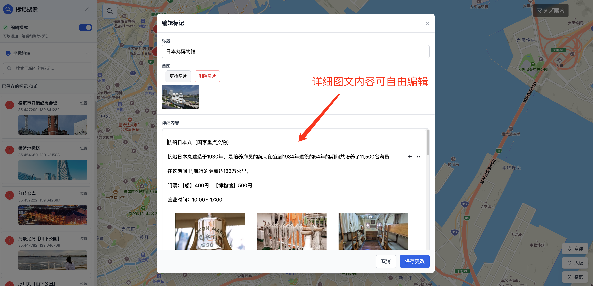
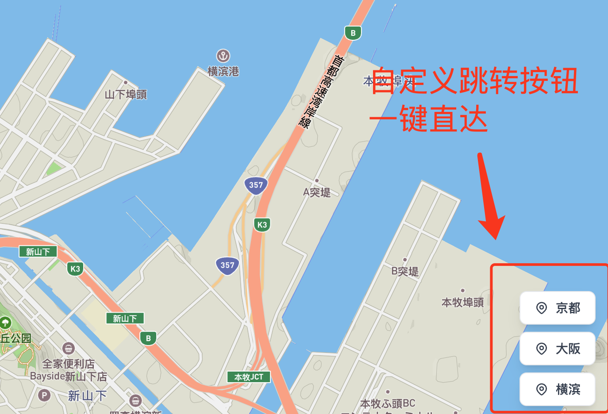

# マップ案内 (MapAnNai) - 交互式地图编辑器

一个基于Next.js和Mapbox的交互式地图标记编辑平台，支持富文本内容编辑、坐标跳转、标记分类等功能。

## 🚀 快速开始

### 0. 环境变量配置

#### 0.1 复制环境变量文件
```bash
cp .env.example .env
```

#### 0.2 编辑 .env 文件
根据您的实际配置修改 `.env` 文件中的值：

```bash
# 应用配置
NEXT_PUBLIC_APP_NAME=マップ案内 - 交互式地图编辑器
NEXT_PUBLIC_APP_VERSION=1.0.0

# 地图默认配置
NEXT_PUBLIC_DEFAULT_LATITUDE=35.452
NEXT_PUBLIC_DEFAULT_LONGITUDE=139.638
NEXT_PUBLIC_DEFAULT_ZOOM=14.09

# Mapbox 配置
NEXT_PUBLIC_MAPBOX_ACCESS_TOKEN=pk.your_mapbox_public_token_here
MAPBOX_SECRET_ACCESS_TOKEN=sk.your_mapbox_secret_token_here
MAPBOX_USERNAME=your_mapbox_username
MAPBOX_DATASET_ID=your_dataset_id_here
NEXT_PUBLIC_MAPBOX_STYLE=mapbox://styles/mapbox/streets-zh-v1

# 腾讯云 COS 配置
TENCENT_COS_SECRET_ID=your_tencent_secret_id
TENCENT_COS_SECRET_KEY=your_tencent_secret_key
TENCENT_COS_REGION=ap-chongqing
TENCENT_COS_BUCKET=your_bucket_name

# Next.js 图片域名配置
NEXT_PUBLIC_IMAGE_DOMAINS=your-bucket.cos.ap-chongqing.myqcloud.com
```

### 1. Mapbox 配置申请

#### 1.1 创建 Mapbox 账户
1. 访问 [Mapbox官网](https://www.mapbox.com/)
2. 注册新账户或登录现有账户
3. 进入 [Account页面](https://account.mapbox.com/)

#### 1.2 获取 Access Token
1. 在 Account 页面找到 "Access tokens" 部分
2. 创建新的密钥


全部勾选，点击Create token按钮
3. 将获取的 token 添加到 `.env` 文件中：
```bash
NEXT_PUBLIC_MAPBOX_ACCESS_TOKEN=pk.your_token_here
MAPBOX_SECRET_ACCESS_TOKEN=sk.your_secret_token_here
```

#### 1.3 创建 Dataset（可选）
1. 访问 [Mapbox Datasets](https://studio.mapbox.com/datasets/)
2. 点击 "New dataset"
3. 选择 "Empty dataset"
4. 记录下 Dataset ID

### 2. 腾讯云 COS 配置

#### 2.1 创建 COS 存储桶
1. 登录 [腾讯云控制台](https://console.cloud.tencent.com/)
2. 进入对象存储 COS 服务
3. 创建新的存储桶，名称如：`mapannai-1253047877`
4. 配置存储桶权限（允许公共读取）

#### 2.2 创建 API 密钥
1. 进入 [访问管理 CAM](https://console.cloud.tencent.com/cam/capi)
2. 创建新的密钥
3. 记录 SecretId 和 SecretKey

#### 2.3 配置环境变量
将获取的密钥添加到 `.env` 文件中：
```bash
TENCENT_COS_SECRET_ID=your_secret_id
TENCENT_COS_SECRET_KEY=your_secret_key
TENCENT_COS_REGION=ap-chongqing
TENCENT_COS_BUCKET=your_bucket_name
NEXT_PUBLIC_IMAGE_DOMAINS=your-bucket.cos.ap-chongqing.myqcloud.com
```

### 3. 添加城市配置
在 `cities` 配置中添加您需要的城市：

```typescript
cities: {
    // 现有城市...
    yourCity: {
        name: '您的城市名',
        coordinates: { longitude: 经度, latitude: 纬度 },
        zoom: 缩放级别
    },
}
```

## 🚀 部署到 AWS Amplify

#### 创建 Amplify 应用
登录 [AWS Amplify Console](https://console.aws.amazon.com/amplify/)


## 🎯 功能详情






#### 1. 标记分类
- **活动** 🎯：活动和娱乐场所
- **位置** 📍：一般地点标记
- **酒店** 🏨：住宿和酒店
- **购物** 🛍️：购物中心和商店

#### 2. 富文本编辑
- 支持标题、段落、列表
- 支持引用、图片
- 支持链接和格式化

#### 3. 数据同步
- 标记数据自动保存到 Mapbox Dataset
- 图片自动上传到 AWS S3
- 支持多人协作编辑


## 🤝 贡献指南

1. Fork 项目
2. 创建功能分支 (`git checkout -b feature/AmazingFeature`)
3. 提交更改 (`git commit -m 'Add some AmazingFeature'`)
4. 推送到分支 (`git push origin feature/AmazingFeature`)
5. 打开 Pull Request

## 📞 支持

如果您遇到问题或有建议，请：

1. 查看 [Issues](../../issues) 页面
2. 创建新的 Issue
3. 联系项目维护者

